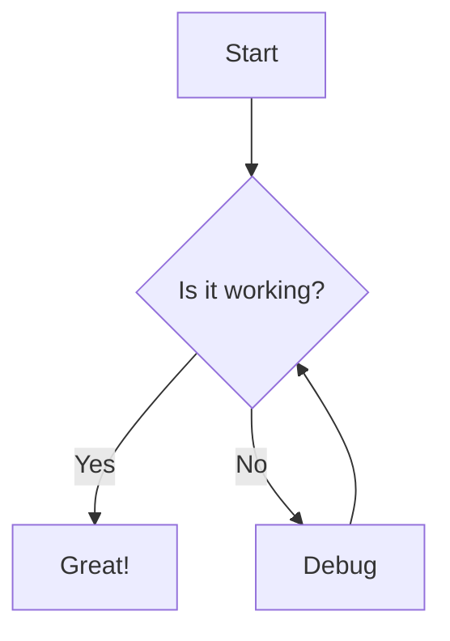
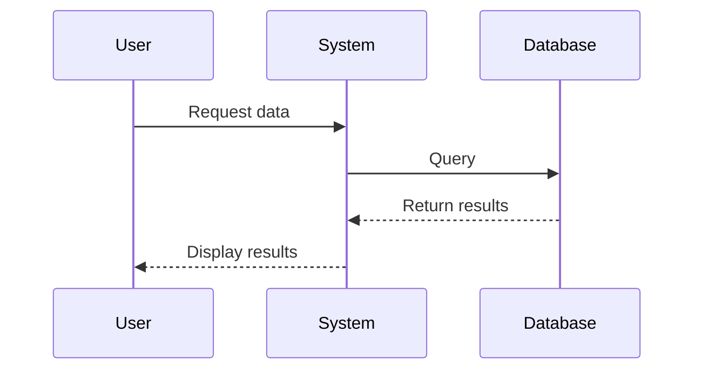

# markdown example file

this is a simple markdown file demonstrating various features that should be supported by the syfe plugin.

## text formatting

**bold text** or __alternate bold__

*italic text* or _alternate italic_

***bold and italic*** or ___alternate bold italic___

~~strikethrough~~ (if supported)

## lists

unordered list:
- item 1
- item 2
  - nested item
  - another nested item
- item 3

ordered list:
1. first item
2. second item
   1. nested ordered item
   2. another nested item
3. third item

task list:
- [x] completed task
- [ ] incomplete task

## links and images

[link to example.com](https://example.com)


## blockquotes

> this is a blockquote
> spanning multiple lines
>
> with a blank line in between

## code

inline `code` example

```go
package main

import "fmt"

func main() {
    fmt.Println("hello world")
}
```

```python
def hello():
    print("hello world")
    
if __name__ == "__main__":
    hello()
```

```javascript
function hello() {
    console.log("hello world");
}
hello();
```

## tables

| header 1 | header 2 | header 3 |
|----------|----------|----------|
| cell 1   | cell 2   | cell 3   |
| cell 4   | cell 5   | cell 6   |

## horizontal rules

---

***

___

## heading levels

# heading 1
## heading 2
### heading 3
#### heading 4
##### heading 5
###### heading 6

## html embedded

<div style="color: blue;">
  this is <b>html</b> content
</div>

## footnotes

here's a sentence with a footnote[^1].

[^1]: this is the footnote content.

## yaml frontmatter

```yaml
---
title: markdown example
author: syfe test
date: 2025-02-27
---
```

## mermaid diagrams




